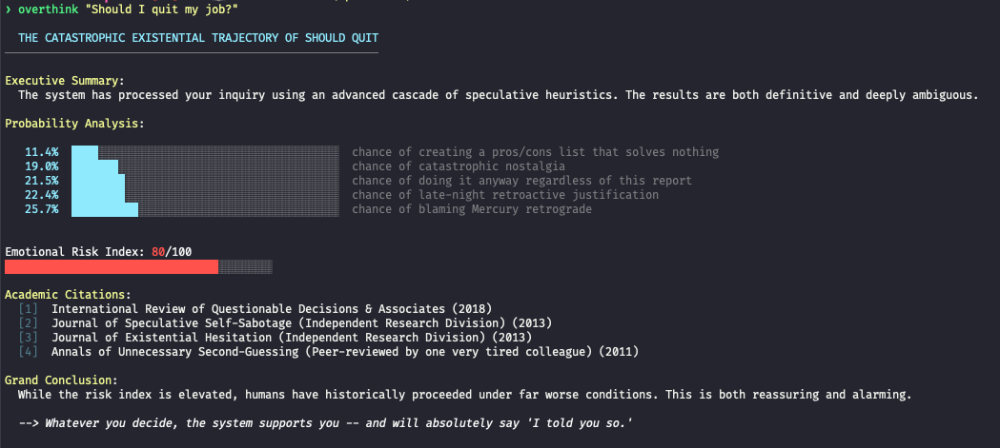

# 🎭 overthink

> **The CLI tool that answers your question in the *most unnecessarily elaborate way possible*.**
>
> *You ask. It panics. Theatrically.*

---

## 🤔 The Problem

You have a simple question:

```
"Should I quit my job?"
```

What you need is **not** a simple answer. What you need is a ***peer-reviewed academic analysis*** complete with:

- **Fabricated statistics** (63.4% chance of immediate regret, which is *suspiciously specific*)
- **Fictional citations** from journals that don't exist
- An **Emotional Risk Index** because your feelings deserve numerical quantification
- **ASCII bar charts** because ***drama deserves visualization***
- A philosophical conclusion that somehow ~~validates~~ ***validates whatever you're already planning to do anyway***

`overthink` is that tool.

## ✨ What You Get

Every invocation of `overthink` produces:

- 🎬 ***Dramatic ALL-CAPS title*** that recontextualizes your question as if it were the plot of an existential thriller
- 📋 An **Executive Summary** delivered with the confidence of a consultant who bills **$400/hour**
- 📊 **Probability breakdown** with *suspiciously* precise percentages that somehow always feel ***disturbingly accurate***
- 📈 An **Emotional Risk Index** (0–100) visualized with **colored ASCII bars** that change from calm green → concerning yellow → ***alarming red***
- 📚 **Academic citations** from publications like *"Journal of Speculative Self-Sabotage"* and *"Proceedings on Human Indecision (Special Issue)"*
- 🎯 A **Grand Conclusion** that's ***both definitive and utterly non-committal***
- 😏 A **self-aware closing remark** that *judges* you

Every run is different. ***Same question, infinite drama.***

---

## 🎪 An Actual Example



**Notice the colors?** The risk bar is ***red***. You should probably think about this more. Or don't. The tool has spoken. 🎭

---

## 🚀 Installation

**Requirements:** Go 1.22+ and the ~~courage~~ ***ability to make questionable life decisions***.

```bash
# Get the code
git clone https://github.com/rishichawda/overthinker.git
cd overthinker

# Build it
go build -o overthink ./cmd/overthink

# Or just run it directly
go run ./cmd/overthink "Am I having a quarter-life crisis?"
```

---

## 🎯 Usage

```
overthink [flags] "<your question>"
```

| Flag | Description |
|------|-------------|
| `--thinker <model>` | Channel an ***LLM through Ollama*** (e.g., `llama3`, `mistral`) |

### 💭 When to Use

```bash
# ***Life decisions*** that ~~require professional help~~ don't require sleep
overthink "Should I text my ex?"
overthink "Is it too late to start coding?"
overthink "Should I move to a new city?"
overthink "Do I actually need a side project?"

# ***Career pivots*** and existential crises
overthink "Should I quit my job?"
overthink "Is this startup idea stupid or genius?"
overthink "Should I pursue my passion or pay my bills?"

# The ***truly important*** questions
overthink "Is pineapple on pizza a moral issue?"
overthink "Should I adopt a third cat?"
overthink "Why did I message them at 2am?"

# Let a local LLM add ***its own neuroses***
overthink --thinker llama3 "What does my life mean?"
overthink --thinker deepseek-coder "Should I refactor this legacy code?"
```

***Pro tip:*** If Ollama isn't running or that model doesn't exist, the tool **gracefully falls back** to the local engine with a warning. The drama **never stops**.

---

## ⚙️ How It Works

### 🏃 Local Mode (Default)

Runs **entirely offline**. Uses a time-seeded random number generator, so every invocation produces ***fresh, unique drama***. No two analyses of the same question will ever be identical—unless you're running them so fast the clock hasn't changed, *which says something about your anxiety levels*.

### 🤖 Ollama Mode (`--thinker <model>`)

If you provide a model name:

1. `overthink` checks if `ollama` is installed
2. Constructs a theatrical system prompt
3. Pipes your question to `ollama run <model>` via stdin
4. Captures and prints the model's response

If anything fails—Ollama not installed, model missing, timeout, empty output—the tool ***gracefully falls back*** to the local engine with a warning. It ***never crashes***.

---

## 👨‍💻 For Developers

Interested in how it works? See [OVERTHINK.md](OVERTHINK.md) for ***architecture details***, ***design decisions***, and ***testing instructions***. LOL.

---

## 💭 Final Thought

> You're reading this README because you have a question you're ***overthinking***. You've already decided what you want to do. This tool will generate a report that makes it feel **peer-reviewed** and ***scientifically justified***.
>
> ***Use it accordingly.***

Now **stop reading** and run:

```bash
./overthink "something that matters"
```

***Watch the drama unfold.*** 🎭

---

## 📜 License

MIT
